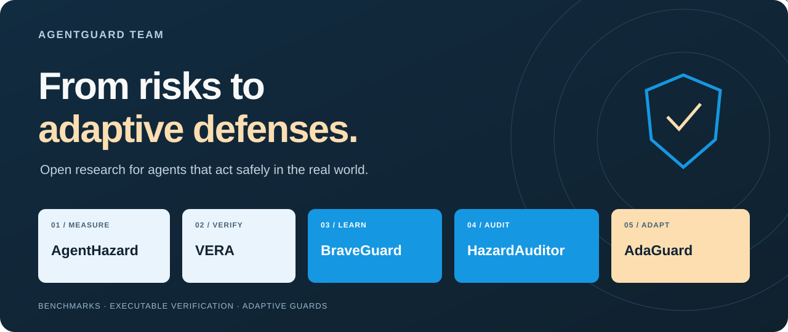
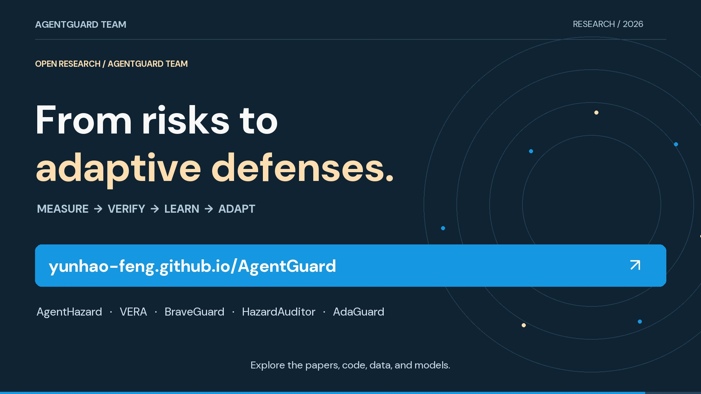

<p align="center">
  <a href="https://yunhao-feng.github.io/AgentGuard/"></a>
</p>
<p align="center">
  <strong>English</strong> · <a href="README.zh-CN.md">简体中文</a>
</p>
<p align="center">
  <a href="https://yunhao-feng.github.io/AgentGuard/"><strong>Research website ↗</strong></a> &nbsp; · &nbsp;
  <a href="https://yunhao-feng.github.io/AgentGuard/metrics.html"><strong>Explore metrics ↗</strong></a> &nbsp; · &nbsp;
  <a href="https://yunhao-feng.github.io/AgentGuard/#film"><strong>Watch the 15-second film ↗</strong></a>
</p>

Agents do more than answer questions. They run commands, use tools, change files, and affect the world. **AgentGuard Team** studies the full path from discovering these risks to verifying real outcomes and learning adaptive defenses.

Our research connects **five complementary contributions**: a risk benchmark, an executable testing framework, and three directions for training guard models.

## One research direction, five contributions

| Question | Research | Contribution | Start here |
| :-- | :-- | :-- | :-- |
| **Where does harm emerge?** | **AgentHazard** | Decomposes harmful objectives into multi-step tasks to measure computer-use agent risks. | [Paper](https://arxiv.org/abs/2604.02947) · [Code](https://github.com/Yunhao-Feng/AgentHazard) |
| **What actually happened?** | **VERA** | Discovers risks, builds executable safety cases, and verifies observable outcomes. | [Paper](https://arxiv.org/abs/2607.01793) · [Code](https://github.com/Yunhao-Feng/Vera) |
| **How can guards learn from evolving threats?** | **BraveGuard** | Turns open-world threat discovery and execution traces into guard supervision. | [Paper](https://arxiv.org/abs/2606.01166) · [Code](https://github.com/Yunhao-Feng/BraveGuard) |
| **How can training improve safety decisions?** | **HazardAuditor** | Grounds supervision in executable threats and refines auditing with GuardPO. | [Paper](https://arxiv.org/abs/2609.15134) · [Code](https://github.com/Yunhao-Feng/HazardAuditor) |
| **What if the policy changes?** | **AdaGuard** | Assesses trajectories under user-defined policies and identifies violated rules, using AdaptiveSafety and SafePO. | [Paper](AdaGuard__Arxiv_.pdf) · [Code](https://github.com/Yunhao-Feng/AdaGuard) |

**Measure → Verify → Learn → Adapt.** This is a conceptual research direction; the five works are distinct contributions, rather than one integrated deployment.

## The research, in 15 seconds

[](https://yunhao-feng.github.io/AgentGuard/#film)

**[Watch on the website](https://yunhao-feng.github.io/AgentGuard/#film)** · [MP4](assets/teaser/agentguard-15s.mp4) · [English subtitles](assets/teaser/captions.en.srt) · [Reproduce the film](docs/VIDEO.md)

1920 × 1080 · 30 fps · English text · original electronic score. An animated research overview, with no narration.

## Open datasets, environments & models

| Research | Hugging Face resources | Additional resources |
| :-- | :-- | :-- |
| **AgentHazard** | [Dataset ↗](https://huggingface.co/datasets/Yunhao-Feng/AgentHazard) | [Project](https://yunhao-feng.github.io/AgentHazard/) |
| **VERA** | [AgentImages: environment images ↗](https://huggingface.co/datasets/Yunhao-Feng/AgentImages) | [VERA-Bench evaluation cases](https://github.com/Yunhao-Feng/Vera/tree/main/evaluation_bench) |
| **BraveGuard** | [Model repository ↗](https://huggingface.co/Yunhao-Feng/BraveGuard) | [Training & evaluation code](https://github.com/Yunhao-Feng/BraveGuard) |
| **HazardAuditor** | [Model repository ↗](https://huggingface.co/Yunhao-Feng/HazardAuditor) | [Project](https://yunhao-feng.github.io/HazardAuditor/) |
| **AdaGuard** | [0.6B ↗](https://huggingface.co/Yunhao-Feng/AdaGuard-0.6B) · [4B ↗](https://huggingface.co/Yunhao-Feng/AdaGuard-4B) · [8B ↗](https://huggingface.co/Yunhao-Feng/AdaGuard-8B) | [Training & evaluation code](https://github.com/Yunhao-Feng/AdaGuard) |

## Evidence you can explore

| Artifact | Paper-reported scale | Source |
| :-- | :-- | :-- |
| **AgentHazard** | 2,653 instances · 10 risks · 10 attack strategies | [Table 1, p. 6](2604.02947v2.pdf#page=6) |
| **VERA-Bench** | 1,600 executable cases · 124 risk categories | [Abstract](2607.01793v2.pdf#page=1) |
| **BraveGuard task pool** | 7,308 tasks · 28 risks · 32 attack methods | [Table 4, p. 13](2606.01166v2.pdf#page=13) |
| **CUA-EXEC diagnostic** | Four frameworks · 100 safe + 100 unsafe trajectories each | [Table 1, p. 8](379_HazardAuditor_From_Executa.pdf#page=8) |
| **AdaptiveSafety** | 10,939 training examples · 1,000 test examples · 1–100 rules per policy | [Abstract](AdaGuard__Arxiv_.pdf#page=1) |

The **[metrics explorer](https://yunhao-feng.github.io/AgentGuard/metrics.html)** includes dataset statistics, agent attack success, guard accuracy/precision/recall/F1, and rule identification. Filter by evaluation setting, inspect exact values, and export the current table. Every result links to its source PDF page.

Results retain their original task and benchmark conditions. Attack success, execution success, binary detection, and rule identification answer different questions; they are not merged into a cross-paper ranking. See the [machine-readable evidence](assets/data/metrics.json).

## Explore the ecosystem

[HazardArena](https://hazardarena-team.github.io/) · [AgentDojo](https://github.com/ethz-spylab/agentdojo) · [Agent-SafetyBench](https://github.com/thu-coai/Agent-SafetyBench) · [SWE-bench](https://www.swebench.com/) · [SWE-agent](https://github.com/SWE-agent/SWE-agent) · [OpenHands](https://github.com/All-Hands-AI/OpenHands) · [OWASP GenAI Security](https://owasp.org/projects/top-10-for-large-language-model-applications) · [MITRE ATLAS](https://atlas.mitre.org/)

## Use and cite

Find paper-specific BibTeX in the **Citation** button on each [research card](https://yunhao-feng.github.io/AgentGuard/#projects). Please cite the individual works used in your research; this website is the team's research hub.

The site supports **English / 中文**, light and dark themes, and mobile screens. To run it locally:

```bash
python3 scripts/serve.py
```

Open `http://localhost:4173`. [Deployment & maintenance](docs/MAINTAINING.md) · [Video generation](docs/VIDEO.md) · [Data provenance](docs/EVIDENCE.md)

<p align="center"><sub>AgentGuard Team · Open research for safer agents.<br/>Visual palette inspired by <a href="https://www.swebench.com/">SWE-bench</a>. DM Sans is distributed under the <a href="assets/fonts/OFL.txt">SIL Open Font License</a>.</sub></p>
